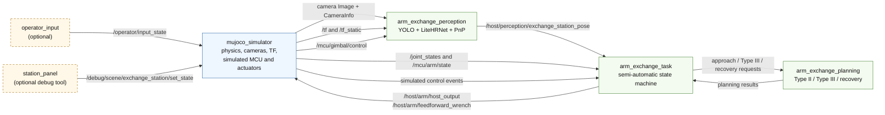

# Runtime Workspace

The runtime workspace connects the published perception and planning algorithms to a ROS 2 Host and a MuJoCo
simulation backend. It is self-contained under `runtime/`. Images, transforms and joint states use standard ROS 2
messages, while task and simulated-controller commands use the small interface package shipped with the workspace.

The current release covers the simulation backend. Real-device drivers and launch files are not included yet.
All commands below are run from the repository root unless stated otherwise.

## Packages

```text
runtime/
├── interfaces/    # ROS 2 messages shared by Host and simulation
├── core/          # Robot model, PnP, collision checking and motion planning
├── host/          # Perception, planning and task-orchestration nodes
├── sim/
│   ├── mujoco_engine/       # Reusable simulator and plugin lifecycle
│   └── arm_exchange_sim/    # Task scene, plugins, controls and assets
└── scripts/       # Build, environment and test commands
```

More detailed package documentation:

- [Host nodes and data flow](host/README.md)
- [Arm-exchange MuJoCo application](sim/arm_exchange_sim/README.md)
- [Reusable MuJoCo engine](sim/mujoco_engine/README.md)

## ROS 2 Architecture

The technical report separates the system into an upper-computer layer and an interaction backend. The published ROS
2 implementation maps that separation to the nodes below. Solid arrows are the principal runtime data paths; dashed
nodes are optional tools enabled by launch arguments or started in a separate terminal.



`mujoco_simulator` is one ROS node. Its arm controller, operator logic, TF publisher, camera mount and station model are
application plugins hosted inside that node, not additional ROS graph nodes. `arm_exchange_perception` is optional and
is started only when `enable_perception:=true`; `operator_input` is likewise controlled by
`enable_operator_input:=true`. The planning and task nodes are always started by `sim_host.launch.py`.

### Backend Boundary

The Host nodes depend on ROS interfaces rather than MuJoCo APIs. The backend supplies camera images and calibration,
TF, joint and lower-controller feedback, operator events, and a trajectory execution endpoint. The public release
implements this contract only through `mujoco_simulator`. Physical camera drivers, the virtual-gimbal implementation,
encoder/MCU transport and real actuator interfaces are not included.

This boundary follows the simulation/real-backend separation described in the technical report. A physical deployment
can retain the published perception, planning and task nodes and replace the simulation side with robot-specific ROS
publishers and subscribers. Such an adapter must preserve the documented topic types, frame conventions, units,
timestamps and control-authority semantics; it must also provide calibrated camera and parallel-linkage transforms.
The abstraction makes a real backend straightforward to integrate, but it does not make simulation calibration or
controller parameters valid for physical hardware.

The request/result topics between task and planning are separated into approach, Type III and recovery message pairs.
The diagram groups them to preserve the algorithm-level structure used in the technical report. To inspect every topic
and generated helper node in a running system, install the optional ROS visualization package and open the live graph:

```bash
sudo apt install ros-humble-rqt-graph
ros2 run rqt_graph rqt_graph
```

## Environment Setup

The runtime is developed for Ubuntu 22.04, ROS 2 Humble and Python 3.10. Install ROS 2 Humble by following the official
[Ubuntu deb package instructions](https://docs.ros.org/en/humble/Installation/Ubuntu-Install-Debians.html). The ROS
desktop installation and development tools are recommended because this workspace uses `colcon`, `rosdep`, Python
nodes, launch files and generated message interfaces.

After installing ROS 2, load the base environment:

```bash
source /opt/ros/humble/setup.bash
```

The workspace additionally uses ROS interface generation, common message packages, TF2, the ament package index and
the ROS launch libraries. These dependencies are declared in the package `package.xml` files. Install the exact set
with `rosdep` from the repository root:

```bash
sudo rosdep init  # Run once per machine; skip if rosdep is already initialized.
rosdep update
rosdep install --from-paths \
  runtime/interfaces runtime/core runtime/host runtime/sim \
  --ignore-src --rosdistro humble -r -y
```

In particular, `rosdep` resolves the packages providing `rosidl_default_generators`, `geometry_msgs`, `sensor_msgs`,
`std_msgs`, `trajectory_msgs`, `tf2_ros`, `ament_index_python`, `launch` and `launch_ros`. The project-specific
`arm_exchange_*` and `mujoco_engine` packages are built from this repository and are excluded by `--ignore-src`.
No third-party ROS package repository or vendor-specific ROS extension is required for the published simulation path.

Non-ROS numerical, simulation and inference dependencies are listed in
[requirements.txt](requirements.txt). This file installs MuJoCo, OpenVINO, OpenCV, SciPy, hpp-fcl, OMPL and their
supporting Python packages. Install it for the system Python used by ROS 2:

```bash
sudo apt install python3-pip
/usr/bin/python3 -m pip install --user -r runtime/requirements.txt
```

Runtime packages must be available to `/usr/bin/python3`; a Conda environment is neither required nor used by the
workspace build. The build script explicitly passes `/usr/bin/python3` to ament so generated executables use the same
interpreter. Keep NumPy at the version listed in the requirements file because the distributed `hpp-fcl` and
`cmeel-boost` packages use the NumPy 1.x ABI.

## Local Configuration

Create a machine-local configuration before the first build:

```bash
cp runtime/core/arm_exchange_core/system_config.example.yaml \
  runtime/core/arm_exchange_core/system_config.yaml
```

`system_config.yaml` is ignored by Git. The example contains repository-relative model paths and the full robot,
perception and planning configuration. Deployment-specific values should be changed only in the local copy.

The perception backend uses independent OpenVINO devices:

```yaml
keypoint_detector:
  yolo_device: GPU
  hrnet_device: CPU
```

`GPU` is the native OpenVINO device name. On a single-GPU Intel NUC it selects the Intel integrated GPU; use `CPU` for
both stages when that is faster on the target machine. Confirm the available devices before changing the configuration:

```bash
python3 - <<'PY'
from openvino import Core

core = Core()
for device in core.available_devices:
    print(device, core.get_property(device, "FULL_DEVICE_NAME"))
PY
```

Model checkpoints are released separately on
[Hugging Face](https://huggingface.co/hkustenterprize/RM26_engineer_exchange_model). Place the exported directories at
the configured paths under `weights/`, or update the local paths accordingly.

## Build

From the public repository root:

```bash
runtime/scripts/build.sh
source runtime/scripts/setup_env.sh
```

The build includes five packages: `arm_exchange_interfaces`, `arm_exchange_core`, `mujoco_engine`,
`arm_exchange_sim`, and `arm_exchange_host`.

## Launch

For the normal interactive workflow, start perception, operator input and the simulation together. A readable Linux
keyboard event device is required. First identify the keyboard:

```bash
ls -l /dev/input/by-id /dev/input/by-path
sudo apt install evtest
sudo evtest
```

Prefer a stable `by-id` or `by-path` entry when one is available. Otherwise, use the corresponding `/dev/input/eventN`
entry reported by `evtest`; `eventN` is an example placeholder rather than a fixed device name.

The current user needs read access to the selected device. On distributions that provide the `input` group, grant
membership once:

```bash
sudo usermod -aG input "$USER"
```

Log out of the desktop session completely and log back in before verifying the new membership and device permission:

```bash
export KEYBOARD_DEVICE=/path/to/the/keyboard-event-device
id -nG | tr ' ' '\n' | grep '^input$'
test -r "$KEYBOARD_DEVICE" && echo "keyboard device is readable"
```

Replace `/path/to/the/keyboard-event-device` with the path identified above. The variable is intentionally set after
the new login session begins.

Group membership takes effect only in a new login session. Avoid running the complete ROS launch with `sudo`; doing so
changes the ROS and Python environments and grants unnecessary privileges to every node.

Then launch the interactive stack:

```bash
ros2 launch arm_exchange_host sim_host.launch.py \
  enable_perception:=true \
  enable_operator_input:=true \
  keyboard_device:="$KEYBOARD_DEVICE"
```

Raw mouse events are not part of the operator interface; all task and camera controls use the keyboard map documented
in the simulation guide.

For a non-interactive core smoke test, perception and operator input may be omitted:

```bash
ros2 launch arm_exchange_host sim_host.launch.py
```

Perception can also be tested without operator input:

```bash
ros2 launch arm_exchange_host sim_host.launch.py \
  enable_perception:=true \
  camera_view:=true
```

Useful launch arguments:

| Argument | Default | Meaning |
| --- | --- | --- |
| `enable_perception` | `false` | Start YOLO, LiteHRNet and PnP perception. |
| `camera_view` | `true` | Show the OpenCV perception overlay when perception is enabled. |
| `enable_operator_input` | `false` | Start the raw Linux input node. |
| `keyboard_device` | empty | Required keyboard `/dev/input` event path when operator input is enabled. |
| `sim_config_path` | package default | Override the MuJoCo application YAML. |

The station-state panel is a debugging tool and is intentionally launched in a separate terminal:

```bash
source runtime/scripts/setup_env.sh
ros2 run arm_exchange_sim station_panel
```

Its controls and the complete operator key map are documented in the
[simulation package guide](sim/arm_exchange_sim/README.md).

## Tests

Run the package and runtime contract tests with:

```bash
runtime/scripts/test.sh
```

The script loads the workspace, disables unrelated user-site pytest plugins, runs tests for all five packages and
prints the complete colcon result.

For interface inspection and simulation smoke commands, see the
[simulation package guide](sim/arm_exchange_sim/README.md).
