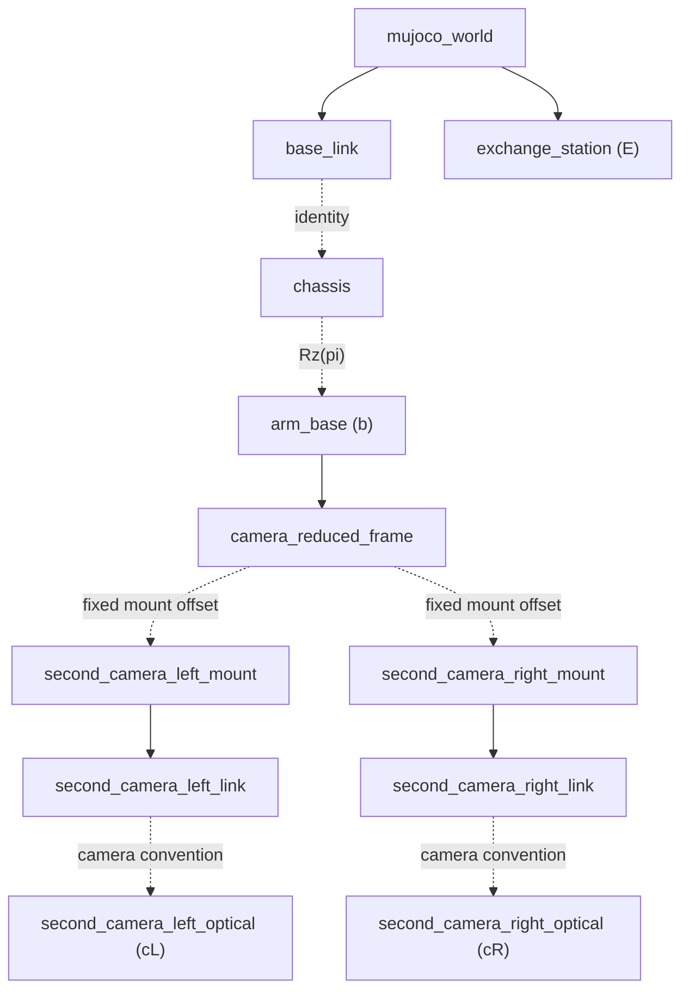

# Arm Exchange MuJoCo ROS2 Sim

This package contains the plugins, scenes, assets, and configuration for the
public arm-exchange simulation. The reusable execution loop, model builder,
plugin lifecycle, and renderer are provided by the sibling `mujoco_engine`
package.

## Launch

The complete Host + simulation launch is documented in the [runtime guide](../../README.md). To start only this MuJoCo
application package:

```bash
source runtime/scripts/setup_env.sh
ros2 launch arm_exchange_sim arm_exchange_sim.launch.py
```

Model assets are package-local under `arm_exchange_sim/model/model`, matching
the current ROS2 simulation packaging style. The ROS2 sim model may
intentionally diverge from the repository-level `model/` assets as the exchange
scene evolves.

## Application Plugins

The package supplies the task-specific plugins loaded by `mujoco_engine`:

| Plugin | Responsibility |
| --- | --- |
| `CameraMountPlugin` | Applies the reduced parallel-linkage kinematics to the simulated camera-mount mocap body. |
| `ArmExchangeTfPlugin` | Publishes the world, chassis, arm, station and camera TF relationships. |
| `ArmPlugin` | Emulates lower-controller authority, arm feedback and torque control for Host trajectories. |
| `OperatorLogicPlugin` | Converts raw operator input into simulated control frames, chassis motion and camera control. |
| `StationPlugin` | Applies validated exchange-station rule variables to MuJoCo joints and actuators. |

All five plugins execute inside the single `mujoco_simulator` ROS node. Their order in `simulation_config.yaml` is also
their order in the per-step callback sequence.

## Runtime Interfaces

- Publishes `/tf` and `/tf_static`.
- Publishes `/joint_states` as `sensor_msgs/JointState`.
- Subscribes `/operator/input_state` as
  `arm_exchange_interfaces/OperatorInputState`.
- Subscribes `/host/arm/host_output` as
  `arm_exchange_interfaces/ArmHost2MCUMsg`.
- Publishes `/mcu/arm/state` as `arm_exchange_interfaces/ArmMCU2HostMsg`.
- Publishes `/mcu/arm/ctrl_start`, `/mcu/arm/ctrl_enter`,
  `/mcu/arm/ctrl_q`, and `/mcu/arm/ctrl_withdraw` to emulate MCU control frames.
- Publishes `/sim/mcu/arm_enabled` as `std_msgs/Bool`; this is the simulated
  MCU-side host-control enable bit. When disabled, Host must reset to IDLE.
- When MCU host-control is enabled and Host state is an executing state, the
  simulated lower controller tracks `/host/arm/host_output`. When disabled, it
  drives the arm back to configured `home_positions`.
- Publishes `/sim/state/operator_mode`, `/sim/state/control_authority`, and
  `/sim/state/active_camera`.
- Publishes `/second_camera_left/image_raw` and
  `/second_camera_right/image_raw` as `sensor_msgs/Image`, together with their
  `sensor_msgs/CameraInfo` topics.
- Subscribes `/debug/scene/exchange_station/set_state` as
  `arm_exchange_interfaces/ExchangeStationState`.

## Operator Input

Run the raw-input node in a separate terminal:

```bash
source runtime/scripts/setup_env.sh
ros2 run arm_exchange_sim operator_input --ros-args \
  -p keyboard_device:=/dev/input/by-path/platform-i8042-serio-0-event-kbd
```

Key map:

- Hold `w/a/s/d`: chassis x/y movement in operator teleop mode.
- Hold `q/e`: chassis yaw in operator teleop mode.
- `1/2/3`: select exchange level and keep operator teleop mode.
- `4`: select manual-Q operator mode.
- `tab`: cycle operator mode.
- `c`: switch active camera state.
- Hold `h/j/k/l`: gimbal left/down/up/right control in teleop mode.
- `esc`: return control authority to `operator`.
- `x`: exit operator input node.

The input node reads Linux `/dev/input/event*` directly, then publishes
`/operator/input_state` at `publish_rate` Hz. Keyboard fields are current held
states. Raw mouse events are not used by the operator-control path. If the device cannot be opened, make sure the current user is in
the `input` group and start a new login session.

Left and right second-camera views use independent MuJoCo yaw/pitch joints.
Pressing `c` switches the active view; `h/j/k/l` then adjusts only that view.

## Coordinate Frames

The current simulation publishes the following TF tree. Solid edges vary during simulation; dashed edges are fixed
after startup.



`mujoco_world -> base_link` follows the chassis body, and `mujoco_world -> exchange_station` follows the station body.
`base_link -> chassis` is identity in the public scene; `chassis -> arm_base` applies the fixed axis convention used by
the arm model. Planning, FK/IK and the perception output all use `arm_base` as their root frame. PnP first estimates
the station pose in the active optical frame, then the perception node uses TF to publish that pose in `arm_base`.

### Parallel Camera Linkage

The camera mount is mechanically coupled to the first two arm joints through a parallel linkage. It therefore cannot
be represented as a simple fixed camera transform or as an ordinary serial continuation of the six-joint DH chain.
`camera_reduced_frame` is a virtual reduced frame computed from joint 1 and joint 2: its position follows the linkage
endpoint, while its orientation compensates the parallel mechanism. The fixed transform from this reduced frame to
each camera mount is then composed with the camera's own yaw/pitch joints and optical-frame convention.

In simulation, the reduced kinematics come from `ArmModel`, and the remaining mount/link offsets are measured directly
from the MuJoCo model at startup. On the physical robot, manufacturing tolerances, linkage geometry, camera mounting
and encoder zero offsets make these transforms machine-specific. We therefore use a dedicated hand-eye calibration
procedure that fits the camera relation against arm joint states instead of treating the camera as a fixed rigid body
on one serial link.

The physical hand-eye calibration script and its collected calibration data are **not included in the current public
release**. The repository publishes the simulation TF implementation and the runtime interface only. Users adapting
the stack to another robot must provide their own calibrated parallel-linkage camera model and fixed optical
extrinsics; copying the simulation offsets into a real deployment is not valid.

### Optical Convention

Perception treats `/second_camera_*` images and `CameraInfo` as OpenCV optical
frames: x right, y down, z forward. The sim publishes an explicit
`second_camera_*_link -> second_camera_*_optical` static transform because
MuJoCo cameras use a different camera convention. The real virtual-gimbal path
currently publishes `link -> optical` as identity because its rectified virtual
image is already labeled in the OpenCV/PnP optical convention. In other words,
real `second_camera_*_link` is currently an optical-frame alias, not a physical
camera-body frame. If that link is later redefined as a physical frame, the
virtual-gimbal image generation must apply the corresponding fixed
`link -> optical` rotation before publishing images with the optical frame id.

## Debug Commands

```bash
ros2 run tf2_ros tf2_echo arm_base exchange_station
ros2 run tf2_ros tf2_echo arm_base second_camera_left_optical
ros2 topic hz /joint_states
ros2 topic hz /second_camera_left/image_raw
ros2 topic echo /second_camera_left/camera_info
```

Command smoke:

```bash
ros2 topic pub --once /sim/mcu/arm_enabled std_msgs/msg/Bool "{data: true}"
ros2 topic pub --once /host/arm/host_output arm_exchange_interfaces/msg/ArmHost2MCUMsg \
  "{host_state: 3, position: [0.0, 0.3, 0.4, 0.0, 0.0, 0.0], velocity: [0.0, 0.0, 0.0, 0.0, 0.0, 0.0]}"
```

Station state smoke:

```bash
ros2 topic pub --once /debug/scene/exchange_station/set_state arm_exchange_interfaces/msg/ExchangeStationState \
  "{x: -0.05, y: 0.2, z: 0.6, alpha: 0.0, theta: 0.0, phi: 0.0}"
```

`ExchangeStationState` matches the MuJoCo/rule variables directly:
`x, y, z, alpha, theta, phi`. The sim validates the configured rule ranges
before writing the corresponding MuJoCo `level_*` joints.

## Station Panel

Run the curses-based station panel in a separate terminal:

```bash
source runtime/scripts/setup_env.sh
ros2 run arm_exchange_sim station_panel
```

The panel edits `x, y, z, alpha, theta, phi` within the same rule ranges as the
sim config. Use up/down to select a field, left/right to adjust its local value,
`[` and `]` to change the step scale, `space` to publish the current values,
`r` to reset, and `q` to quit. `Enter` is intentionally unused so the panel's
publish action cannot be confused with the main operator confirmation key.
