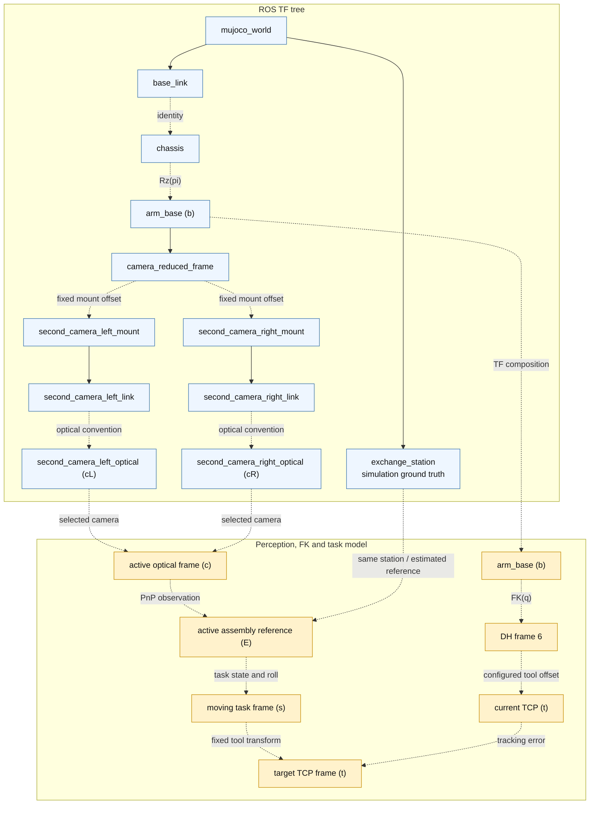

# Arm Exchange MuJoCo ROS2 Sim

This package contains the plugins, scenes, assets, and configuration for the
public arm-exchange simulation. The reusable execution loop, model builder,
plugin lifecycle, and renderer are provided by the sibling `mujoco_engine`
package.

## Launch

The complete Host + simulation launch is documented in the [runtime guide](../../README.md). To start only this MuJoCo
application package:

```bash
source runtime/scripts/setup_env.sh
ros2 launch arm_exchange_sim arm_exchange_sim.launch.py
```

Model assets are package-local under `arm_exchange_sim/model/model`, matching
the current ROS2 simulation packaging style. The ROS2 sim model may
intentionally diverge from the repository-level `model/` assets as the exchange
scene evolves.

## Application Plugins

The package supplies the task-specific plugins loaded by `mujoco_engine`:

| Plugin | Responsibility |
| --- | --- |
| `CameraMountPlugin` | Applies the reduced parallel-linkage kinematics to the simulated camera-mount mocap body. |
| `ArmExchangeTfPlugin` | Publishes the world, chassis, arm, station and camera TF relationships. |
| `ArmPlugin` | Emulates lower-controller authority, arm feedback and torque control for Host trajectories. |
| `OperatorLogicPlugin` | Converts raw operator input into simulated control frames, chassis motion and camera control. |
| `StationPlugin` | Applies validated exchange-station rule variables to MuJoCo joints and actuators. |

All five plugins execute inside the single `mujoco_simulator` ROS node. Their order in `simulation_config.yaml` is also
their order in the per-step callback sequence.

## Runtime Interfaces

- Publishes `/tf` and `/tf_static`.
- Publishes `/joint_states` as `sensor_msgs/JointState`.
- Subscribes `/operator/input_state` as
  `arm_exchange_interfaces/OperatorInputState`.
- Subscribes `/host/arm/host_output` as
  `arm_exchange_interfaces/ArmHost2MCUMsg`.
- Subscribes `/host/arm/feedforward_wrench` as
  `arm_exchange_interfaces/ArmFeedforwardWrenchMsg`; this research interface is disabled by default.
- Publishes `/mcu/arm/state` as `arm_exchange_interfaces/ArmMCU2HostMsg`.
- Publishes `/mcu/arm/ctrl_start`, `/mcu/arm/ctrl_enter`,
  `/mcu/arm/ctrl_q`, and `/mcu/arm/ctrl_withdraw` to emulate MCU control frames.
- Publishes `/sim/mcu/arm_enabled` as `std_msgs/Bool`; this is the simulated
  MCU-side host-control enable bit. When disabled, Host must reset to IDLE.
- When MCU host-control is enabled and Host state is an executing state, the
  simulated lower controller tracks `/host/arm/host_output`. When disabled, it
  drives the arm back to configured `home_positions`.
- Publishes `/sim/state/operator_mode`, `/sim/state/control_authority`, and
  `/sim/state/active_camera`.
- Publishes `/second_camera_left/image_raw` and
  `/second_camera_right/image_raw` as `sensor_msgs/Image`, together with their
  `sensor_msgs/CameraInfo` topics.
- Subscribes `/debug/scene/exchange_station/set_state` as
  `arm_exchange_interfaces/ExchangeStationState`.

## Force Feedforward Research Interface

The runtime reserves an open-loop force-feedforward path for studying contact retention during the sliding, P-axis and
manual Q-axis stages. Its intended purpose is to superimpose a small contact wrench on position tracking, rather than
to replace the geometric trajectory or the lower-controller feedback loop.

The Host starts from a configured nominal pressure direction in the moving assembly frame and a nominal force
magnitude. At the current task state, it estimates the contact-point tangent from the neighboring task pose and removes
the component of the requested force parallel to that tangent:

```text
f_projected = f_nominal - t_hat (t_hat^T f_nominal)
```

This projection keeps the feedforward force in the local normal plane so it does not directly oppose the prescribed
task motion. The retained-force ratio is checked before publication, and force and torque magnitudes are clamped. The
force is then expressed in the true TCP frame. If the configured contact point is offset from the TCP origin, the
corresponding moment is computed as `contact_offset x force`.

`ArmFeedforwardWrenchMsg` carries the enable flag, Host state, retained-force ratio, TCP force and TCP torque. The
simulation controller accepts it only while Host control is enabled, the message is fresh, and the reported Host state
is one of the supported contact stages. `ArmModel.external_wrench_torque()` maps the TCP wrench to an equivalent joint
torque. The simulated torque command has the conceptual form

```text
tau_command = tau_inverse_dynamics + tau_contact_feedforward + tau_PID
```

before actuator sign conversion and torque limiting. A timeout returns the contact term to zero if wrench updates stop.
These gates prevent a stale command from remaining active after a state transition or loss of Host authority.

This path is **not enabled in the released task workflow**. The tracked configuration sets
`planning.exchange.feedforward_wrench.enabled: false`; there is no force/torque sensor feedback, contact-state
estimator or closed-loop force controller in the public runtime. The message, task-stage projection and simulator-side
torque mapping are retained only as an experimental interface for future force-control research. Enabling it requires
independent validation of frame conventions, force direction, contact location, controller stability and hardware
limits; simulation values must not be transferred directly to a physical robot.

## Operator Input

Run the raw-input node in a separate terminal:

```bash
source runtime/scripts/setup_env.sh
export KEYBOARD_DEVICE=/path/to/the/keyboard-event-device
ros2 run arm_exchange_sim operator_input --ros-args \
  -p keyboard_device:="$KEYBOARD_DEVICE"
```

The path is intentionally machine-specific. Device discovery and `input`-group permission setup are documented in the
[runtime launch guide](../../README.md#launch).

Key map:

- Hold `w/a/s/d`: chassis x/y movement in operator teleop mode.
- Hold `q/e`: chassis yaw in operator teleop mode.
- `1/2/3`: select exchange level and keep operator teleop mode.
- `4`: select manual-Q operator mode.
- `tab`: cycle operator mode.
- `c`: switch active camera state.
- Hold `h/j/k/l`: gimbal left/down/up/right control in teleop mode.
- `esc`: return control authority to `operator`.
- `x`: exit operator input node.

The input node reads Linux `/dev/input/event*` directly, then publishes
`/operator/input_state` at `publish_rate` Hz. Keyboard fields are current held
states. Raw mouse events are not used by the operator-control path.

Left and right second-camera views use independent MuJoCo yaw/pitch joints.
Pressing `c` switches the active view; `h/j/k/l` then adjusts only that view.

## Coordinate Frames

The coordinate model contains both ROS TF frames and frames used only inside perception, FK and planning. Blue nodes in
the diagram are broadcast through `/tf` or `/tf_static`; orange nodes are computed algorithmically and are not
additional TF children. Solid TF edges vary during simulation, while dashed TF edges are fixed after startup.



`mujoco_world -> base_link` follows the chassis body, and `mujoco_world -> exchange_station` follows the station body.
`base_link -> chassis` is identity in the public scene; `chassis -> arm_base` applies the fixed axis convention used by
the arm model. Planning, FK/IK and the perception output all use `arm_base` as their root frame.

The simulation `exchange_station` TF is ground truth for visualization and debugging. Online planning instead consumes
an active assembly reference `E`: PnP estimates `E` in the selected optical frame `c`, and TF composition expresses
that observation in `arm_base` (`b`). The task node may later reconstruct this active reference from current FK after an
operator-confirmed stage. It is therefore a planning value carried in `PoseStamped`, not necessarily the same object as
the continuously broadcast simulation ground-truth frame.

`ArmModel.forward_kinematics()` computes the six DH link frames internally. The final DH frame, referred to as
`frame 6`, is offset by the configured `tcp_offset_6_tcp` to obtain the current tool-center-point frame `t`. Neither
`frame 6` nor TCP is currently broadcast as a ROS TF frame. For Type III planning, the active reference `E` anchors a
moving task frame `s`; assembly state, roll and the fixed tool relation determine the target TCP pose. This is a task
constraint evaluated by the planner, not a second TF parent chain for the physical TCP. The dotted connection between
the current and target TCP frames denotes the tracking error compared by the controller, rather than another frame
transform in the kinematic tree.

Using the transform notation from the technical report, the current TCP pose and the Type III target pose are related
by

```text
T_b,t(q)      = T_b,6(q) T_6,t
T_b,t(target) = T_b,E T_E,s(state, roll) T_s,t
```

Here `T_b,6(q)` comes from the six-link DH forward kinematics, `T_6,t` is the configured frame-6-to-TCP tool offset,
and `T_b,E` is the active assembly reference. `T_E,s` describes the moving task frame at the current assembly state and
roll. In the published planner, the fixed `T_s,t` relation is incorporated into the task geometry used to construct the
target TCP pose.

### Parallel Camera Linkage

The camera mount is mechanically coupled to the first two arm joints through a parallel linkage. It therefore cannot
be represented as a simple fixed camera transform or as an ordinary serial continuation of the six-joint DH chain.
`camera_reduced_frame` is a virtual reduced frame computed from joint 1 and joint 2: its position follows the linkage
endpoint, while its orientation compensates the parallel mechanism. The fixed transform from this reduced frame to
each camera mount is then composed with the camera's own yaw/pitch joints and optical-frame convention.

In simulation, the reduced kinematics come from `ArmModel`, and the remaining mount/link offsets are measured directly
from the MuJoCo model at startup. On the physical robot, manufacturing tolerances, linkage geometry, camera mounting
and encoder zero offsets make these transforms machine-specific. We therefore use a dedicated hand-eye calibration
procedure that fits the camera relation against arm joint states instead of treating the camera as a fixed rigid body
on one serial link.

The physical hand-eye calibration script and its collected calibration data are **not included in the current public
release**. The repository publishes the simulation TF implementation and the runtime interface only. Users adapting
the stack to another robot must provide their own calibrated parallel-linkage camera model and fixed optical
extrinsics; copying the simulation offsets into a real deployment is not valid.

### Optical Convention

Perception treats `/second_camera_*` images and `CameraInfo` as OpenCV optical
frames: x right, y down, z forward. The sim publishes an explicit
`second_camera_*_link -> second_camera_*_optical` static transform because
MuJoCo cameras use a different camera convention. The real virtual-gimbal path
currently publishes `link -> optical` as identity because its rectified virtual
image is already labeled in the OpenCV/PnP optical convention. In other words,
real `second_camera_*_link` is currently an optical-frame alias, not a physical
camera-body frame. If that link is later redefined as a physical frame, the
virtual-gimbal image generation must apply the corresponding fixed
`link -> optical` rotation before publishing images with the optical frame id.

### Virtual Gimbal

The physical design uses fisheye cameras to obtain a wide field of view without mechanically steering the camera.
A virtual-gimbal frontend calibrates the fisheye projection, selects a viewing direction, and reprojects the relevant
rays into a conventional pinhole image. The resulting image and `CameraInfo` use the OpenCV optical convention expected
by the keypoint and PnP pipeline. Camera switching and virtual viewing direction are controlled through the same gimbal
control interface represented by the simulation's yaw/pitch camera joints.

The fisheye calibration, reprojection implementation and physical camera transport are **not included in this public
release**. The MuJoCo backend directly renders equivalent pinhole views and publishes the same image, calibration and
frame interfaces, allowing the public Host nodes to exercise the perception and task pipeline without the real camera
stack. A physical integration must provide its own calibrated virtual-gimbal or pinhole-camera frontend while
preserving those ROS contracts.

## Debug Commands

```bash
ros2 run tf2_ros tf2_echo arm_base exchange_station
ros2 run tf2_ros tf2_echo arm_base second_camera_left_optical
ros2 topic hz /joint_states
ros2 topic hz /second_camera_left/image_raw
ros2 topic echo /second_camera_left/camera_info
```

Command smoke:

```bash
ros2 topic pub --once /sim/mcu/arm_enabled std_msgs/msg/Bool "{data: true}"
ros2 topic pub --once /host/arm/host_output arm_exchange_interfaces/msg/ArmHost2MCUMsg \
  "{host_state: 3, position: [0.0, 0.3, 0.4, 0.0, 0.0, 0.0], velocity: [0.0, 0.0, 0.0, 0.0, 0.0, 0.0]}"
```

Station state smoke:

```bash
ros2 topic pub --once /debug/scene/exchange_station/set_state arm_exchange_interfaces/msg/ExchangeStationState \
  "{x: -0.05, y: 0.2, z: 0.6, alpha: 0.0, theta: 0.0, phi: 0.0}"
```

`ExchangeStationState` matches the MuJoCo/rule variables directly:
`x, y, z, alpha, theta, phi`. The sim validates the configured rule ranges
before writing the corresponding MuJoCo `level_*` joints.

## Station Panel

Run the curses-based station panel in a separate terminal:

```bash
source runtime/scripts/setup_env.sh
ros2 run arm_exchange_sim station_panel
```

The panel edits `x, y, z, alpha, theta, phi` within the same rule ranges as the
sim config. Use up/down to select a field, left/right to adjust its local value,
`[` and `]` to change the step scale, `space` to publish the current values,
`r` to reset, and `q` to quit. `Enter` is intentionally unused so the panel's
publish action cannot be confused with the main operator confirmation key.
