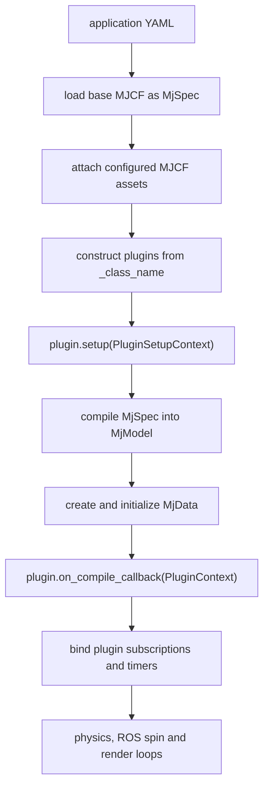

# MuJoCo Engine

`mujoco_engine` is the task-independent ROS 2 execution layer for configuration-driven MuJoCo applications. It owns
model assembly, plugin construction and lifecycle dispatch, physics stepping, camera rendering and the `simulator`
executable. Task-specific scenes, controls and ROS interfaces remain in an application package such as
[`arm_exchange_sim`](../arm_exchange_sim/README.md).

## Design Boundary

The engine knows how to run a MuJoCo model, but it does not know what an exchange station, robot arm or operator mode
means. Its reusable responsibilities are:

- resolving absolute paths and `package://` resources through the ament package index;
- loading a base MJCF file into `mujoco.MjSpec` and optionally attaching additional MJCF models;
- constructing configured Python objects from `_class_name` entries;
- compiling the final `MjSpec` into one `MjModel` and initializing `MjData`;
- binding plugin-declared ROS subscriptions and timers to lifecycle callbacks;
- running the MuJoCo physics loop at the model timestep;
- rendering configured MuJoCo cameras and publishing `sensor_msgs/Image` plus `CameraInfo`;
- optionally displaying the GLFW viewer from the same state snapshots.

The application package owns the MJCF assets, YAML configuration and `BasePlugin` implementations. This keeps the
generic loop reusable while allowing each simulation to define its own actuators, feedback messages, controls and TF
tree.

## Startup and Lifecycle

The simulator is built in the following order:

`PluginSetupContext` exposes the mutable `MjSpec` and ROS node before compilation. A plugin may create publishers or
modify the model at this stage. After compilation, `PluginContext` exposes the immutable model structure, mutable
simulation data, original spec and node. Plugins use `on_compile_callback` to resolve MuJoCo object IDs and allocate
runtime state.

During execution the engine dispatches three callback types:

| Callback | Trigger | Intended responsibility |
| --- | --- | --- |
| `on_step_callback` | Before each `mj_step` | Apply actuator controls or update model state for the next integration step. |
| `on_message_callback` | Configured ROS subscription | Convert an incoming command into simulation state or controller references. |
| `on_timer_callback` | Configured `ros_events` frequency | Publish feedback or other periodic ROS state. |

Plugins declare subscriptions in `ros_subscriptions` as `topic -> message type` and periodic events in `ros_events` as
`alias -> frequency`. The engine creates the corresponding ROS entities and passes the topic or alias back to the
plugin, so application plugins do not duplicate the simulator's subscription and timer plumbing.

## Execution Model

Physics runs in a dedicated high-frequency thread at `1 / model.opt.timestep`. Before every MuJoCo integration step,
all plugin step callbacks execute in configuration order. ROS callbacks run through `rclpy.spin_once`, while camera
and viewer rendering run in the main thread because GLFW requires ownership of its window context.

The authoritative `MjData` is protected by a fair reader/writer lock. Physics and state-changing plugin callbacks take
the write lock. Rendering takes the read lock only long enough to copy a consistent state snapshot, then performs the
more expensive OpenGL work without blocking physics. Each configured camera has an independent frame rate and
publishes a Bayer RGGB image together with intrinsics computed from the MuJoCo camera field of view. This arrangement
keeps rendering cadence separate from the physics timestep while preserving a consistent image/`CameraInfo` stamp.

## Configuration Contract

The application YAML is divided into six engine-level sections:

| Section | Purpose |
| --- | --- |
| `build` | Base scene and optional MJCF attachments. |
| `initialization` | Optional keyframe and actuator-control initial values. |
| `physics` | Physics-loop diagnostics and loop options. |
| `cameras` | MuJoCo camera name, ROS topics, optical frame, resolution and frame rate. |
| `visualization` | GLFW viewer enablement and window settings. |
| `plugins` | Ordered application plugin definitions and their constructor arguments. |

Paths in engine configuration must be absolute or use `package://<package>/<resource>`. The public application uses
package resources, so installed launch files do not depend on the source-tree location.

See [the arm-exchange simulation guide](../arm_exchange_sim/README.md) for the concrete plugins and ROS interfaces
used by this repository.
